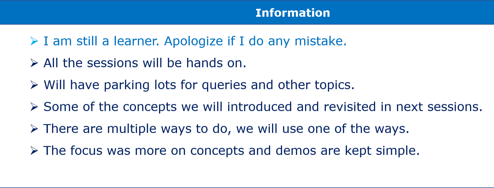

# Introduction to Amazon Kinesis

### Date Time: 15-Oct-2022 at 10:00 AM IST

Event URL:https://www.meetup.com/dot-net-learners-house-hyderabad/events/288853992/

Youtube URL:https://www.youtube.com/watch?v=jtFv--BcKfA

## Prerequisites:

N/A

## Software/Tools

> AWS Kinesis

## Languages:

N/A

## Information

## 

## What are we doing today?

> 1. What is Amazon Kinesis? (Easily collect, process, and analyze video and data streams in real time)
> 2. Kinesis Services
> 3. Kinesis Video Streams
> 4. Kinesis Data Streams
> 5. Kinesis Data Firehose
> 6. Kinesis Data Analytics
> 7. Real-Time Usecase: Click Stream - Example

## 1. What is Amazon Kinesis? (Easily collect, process, and analyze video and data streams in real time)

## 2. Kinesis Services

## 3. Kinesis Video Streams

## 4. Kinesis Data Streams

## 5. Kinesis Data Firehose

## 6. Kinesis Data Analytics

## 7. Real-Time Usecase: Click Stream - Example

